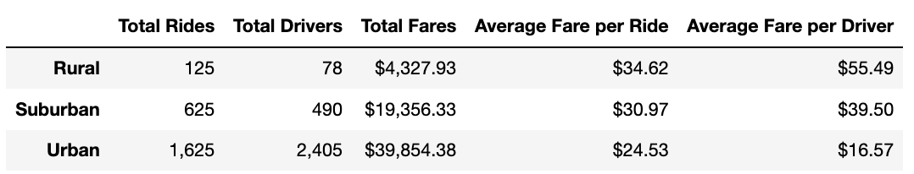

# PyBer_Analysis

## 1. Overview of Analysis

The purpose of this project was to analyze data from PyBer, a ride sharing company. By merging two datasets containing ride and city data, we were able to extract metrics such as total rides, total drivers, total fares, average fare per ride/per driver for each city type (Urban, Suburban, Rural). From this data, we visualized the total fares by city type for time period of January 1, 2019 to April 29, 2019. Based on the metrics and visualization, we were able to gather insight and procure recommendations to PyBer's CEO to address any disparities among the city types.

## 2. Results

#### Fig. 1 Summary Dataframe by City Type

From this chart we can see that the Total Rides count, Total Drivers count, and Total Fares collected, increases from Rural, Suburban, to Urban areas. The Average Fare per Ride and Average Fare per Driver decreases as you move from rural to suburban to urban areas. The more populated an area is the greater the number of drivers, rides taken, and lower the cost per ride and driver. 

#### Fig. 2 Total Fare by City Type

Despite the higher fare cost per ride and driver in rural areas, urban areas outperform all other areas due to greater volume of rides taken.

## 3 Summary:
- Urban cities have the highest total fare and amount of rides, therefore accounting for most of the company's revenue. PyBer should invest in continuing and improving business here. Perhaps further analyses to examine demand for rides and number of drivers would be helpful to ensure the volume demand for rides is being met to ensure max profitability. And if not, to increase drivers to meet the demand. 

- Similarily, it should be examined whether the lower ridership in rural areas is due to lack of demand or lack of available drivers. If low ridership is due to lack of available drivers, PyBer may be losing out on profits. It would be helpful to look at fare cost per mile in each area to examine the cause of higher fare per ride/driver in rural areas is due to distance.

- While Rural Cities and Suburban Cities are underserved, it would be necesary to perform more analyses if there is enough demand to invest in hiring more drivers.
